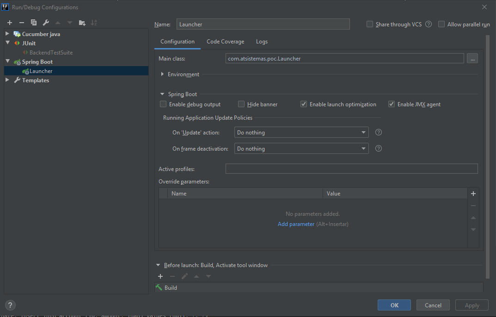
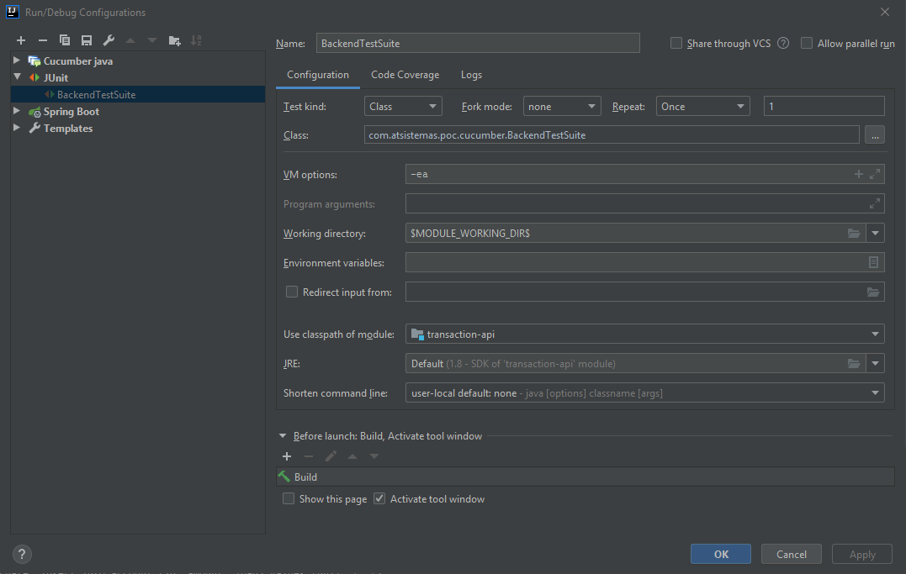

# transaction-api
Exemple APIs

#### With this exercise, I wanted to show you how i would start mounting a project from scratch.

#### Architecture cannot be fixed from the beginning because there may be changes that will make us change it, but the most important thing is to have a struture that is the base (It is the main function of an architect or tech leader ).

#### You can make much more beautiful what I have put but this takes time.

#### I have created a single model because I wanted you to see can be separated into different projects with different layers: persistence, businnes, backend , delivry ..

#### I have not mocketed services with cucmber, this has taken me a while to think the logic.

**prerequisite**
--
To work on the project, you must use **Java 8**, either as an SDK in IntelliJ, or as a runner in Maven

**Creation h2 database locally**
--
I have not considered it necessary for this poc to create the sql scripts to create database.
With the option: 
 
      jpa:
        database-platform: org.hibernate.dialect.H2Dialect
        hibernate:
          ddl-auto: create-drop
        show-sql: true
 
The tables are created when starting Spring Boot and deleted at the end.
It was possible to have integrated **Flyway CLI** to do better.

**Started App**
--
I have not created the different profiles, you could have created different profiles with your own application-xxx.yml (dev, int , pre , prod , test).
I have only used application-test.yml to launch the tests ( Used a RANDOM_PORT in the test execution ).

    @Target(ElementType.TYPE)
    @Retention(RetentionPolicy.RUNTIME)
    @RunWith(SpringJUnit4ClassRunner.class)
    @SpringBootTest(webEnvironment = RANDOM_PORT, classes = Launcher.class)
    @ActiveProfiles("test")
    @AutoConfigureMockMvc
    public @interface Step {
    
    }
    
Run Appli

    
Run Test

**Started Test (Cucumber)**
--
I have used cucumber to make ATDD. The objective is to show you my way of thinking to do this type of test.

I have only done one test but the rest of the tests would be to apply the same logic.

The cucumber test results are saved in target\cucumber, these results could be better if you had added **Senerity**.